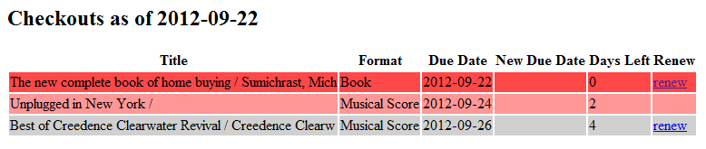
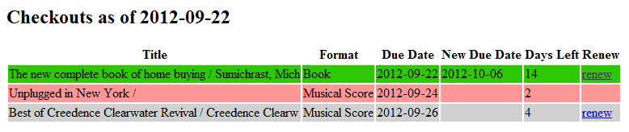

CML-ActivityMgr

This project provides an activity manager and auto-renewer for the
Columbus Metro Library. It also flags items that will expire soon
and which cannot be renewed. It provides cml-activity-mgr which is
designed to be run from cron. A typical invocation is:

    $ cml-activity-mgr --owner='You' --card-number=SECRET0 --pin=SECRET1 --email-to='You <you@somewhere.org>, Other <other@somehwere.org>' --email-from='noreplies@somewhere.org'

Example reports:

    $ cml-activity-mgr -o Stephen --activity-file=t/data/my-account-activity.html --skip-renew --today='2012-09-22' > /tmp/activity0.html

    $ cml-activity-mgr -o Stephen --activity-file=t/data/my-account-activity.html --fake-renew --today='2012-09-22' > /tmp/activity1.html

INSTALLATION

To install this module, run the following commands:

    perl Build.PL
    ./Build
    ./Build test
    ./Build install

SUPPORT AND DOCUMENTATION

After installing, you can find documentation for this module with the
perldoc command (perldoc CML::ActivityMgr) or via the built-in documentation
(cml-activity-mgr -h).

The code is on github: https://github.com/khadrin/CML-ActivityMgr

LICENSE AND COPYRIGHT

Copyright (C) 2012 Stephen J. Smith

This program is free software; you can redistribute it and/or modify it
under the terms of either: the GNU General Public License as published
by the Free Software Foundation; or the Artistic License.

See http://dev.perl.org/licenses/ for more information.

